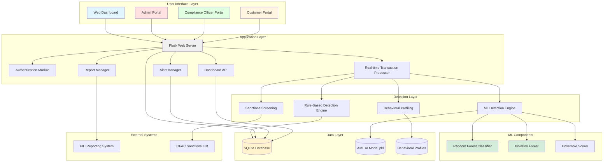
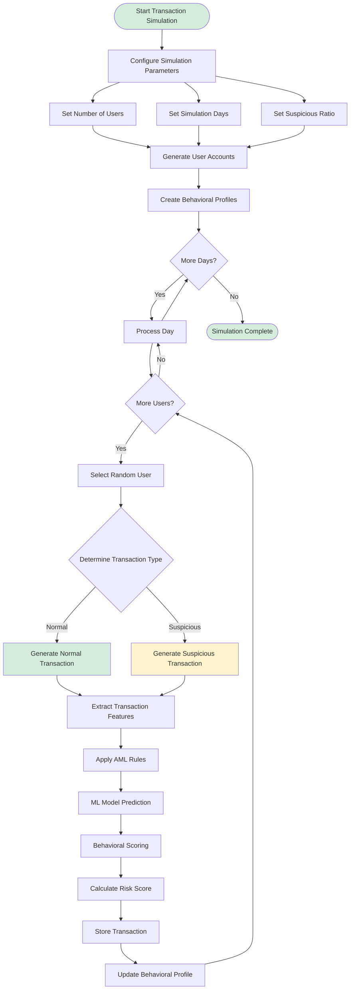
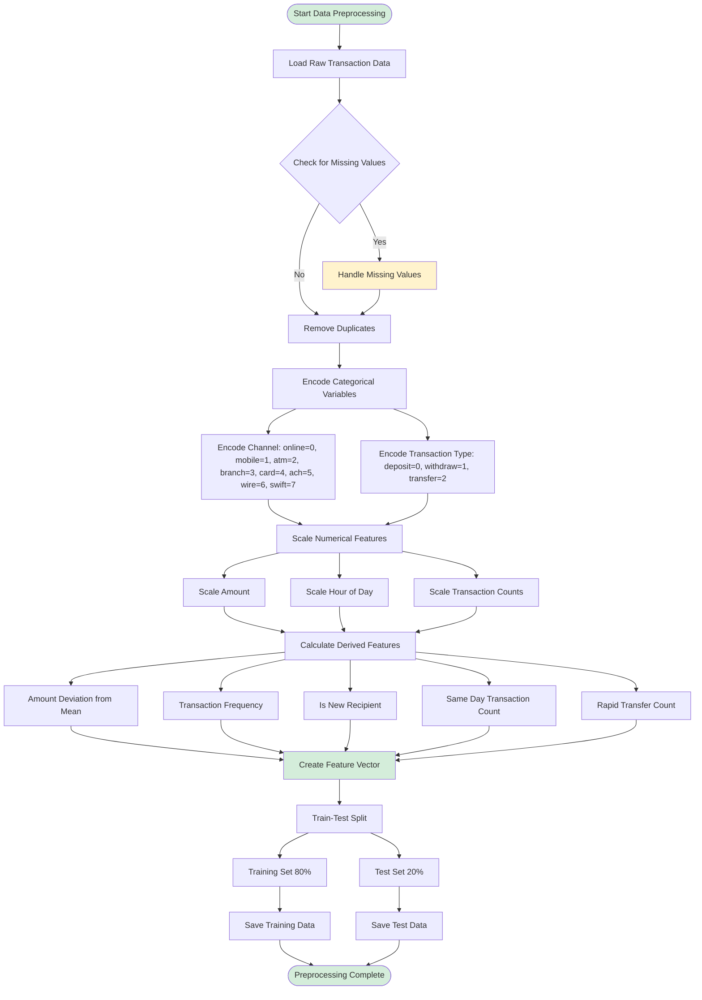
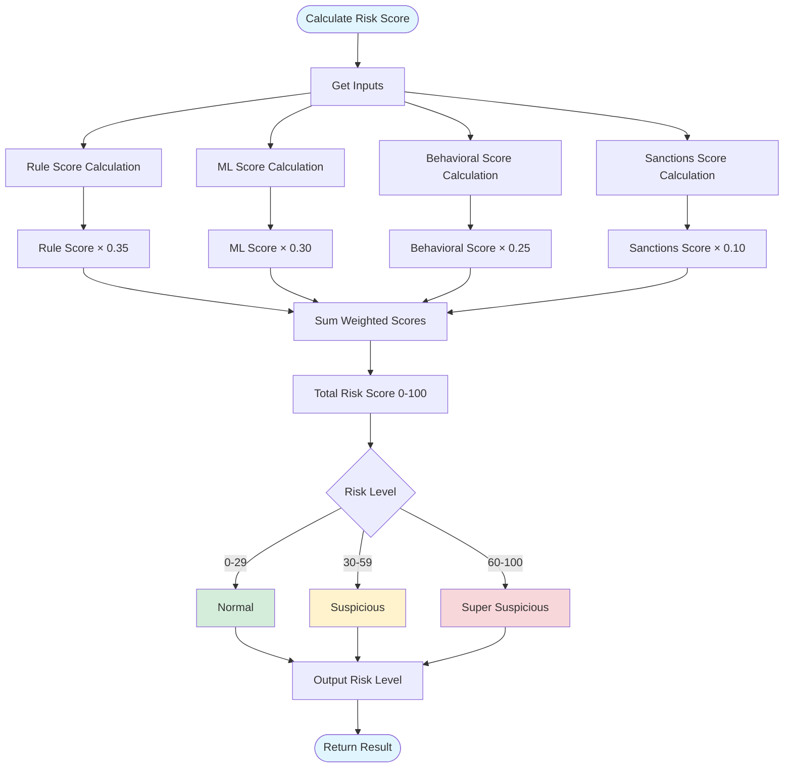
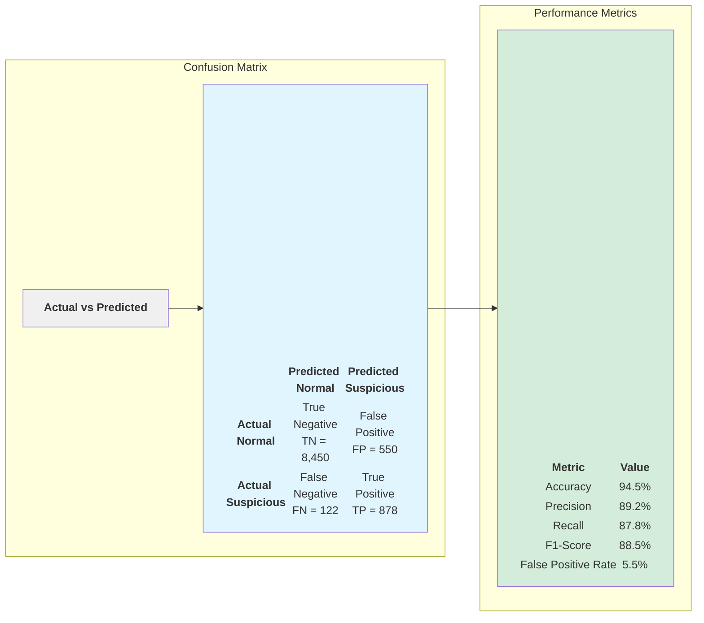

# Chapter 3 System Diagrams (Mermaid Format)

## Diagrams Required for Chapter 3

Based on Chapter 3 placeholders, these are the specific diagrams needed:

1. **System Architecture Diagram** - Section 3.4
2. **Activity Diagram** - Section 3.5 (Transaction Simulation Activity)
3. **Preprocessing Flowchart** - Section 3.5.1 (Data Preprocessing)
4. **Risk Scoring Flowchart** - Section 3.5.2
5. **Confusion Matrix** - Section 3.7.2

---

## 1. System Architecture Diagram (Section 3.4)

---

## 2. Activity Diagram - Transaction Simulation (Section 3.5)

---

## 3. Preprocessing Flowchart (Section 3.5.1)

---

## 4. Risk Scoring Flowchart (Section 3.5.2)

---

## 5. Confusion Matrix (Section 3.7.2)

---

## How to Use These Diagrams

1. **Copy the Mermaid code** for each diagram
2. **Paste into**:
   - [Mermaid Live Editor](https://mermaid.live) - renders as image immediately
   - GitHub/GitLab markdown files
   - VS Code with Mermaid extension
   - Notion, Obsidian, or other markdown editors
3. **Export as PNG/SVG** from Mermaid Live Editor for use in your document

All diagrams are based on the actual system implementation in your codebase and match the descriptions in Chapter 3.
